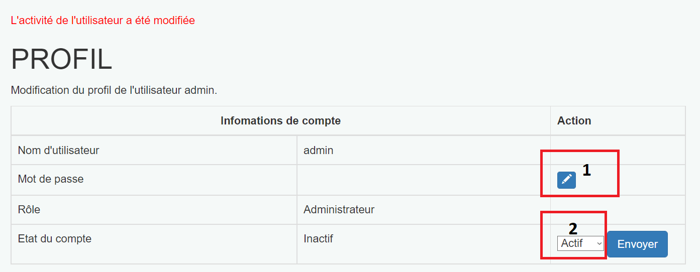

## Description

Implémentation d'un site web **vulnérable** simulant une messagerie.

Ce site permet de tester différents failles de sécurité.

## Installation

Si vous utilisez l'image Docker proposée pour le cours, vous pouvez copier directement le répertoire "site" et son contenu (explications dans la donnée du projet).

#### Install Docker 

Une fois le repos git cloné, il y a deux scripts nommés "install" à la racine du projet. Le fichier .bat est pour Windows et le .sh pour Linux et MacOS.

Le script installera l'image docker automatiquement et lancera les deux commandes pour démarrer nginx et le serveur php.

Une fois le script exécuté vous n'avez plus qu'à aller sur votre navigateur et aller sur l'url : [http://localhost:8080/](http://localhost:8080/)

## Description du repo git

Le répertoire "site" contient deux répertoires :

    - databases
    - html

Le répertoire "databases" contient :

    - database.sqlite : un fichier de base de données SQLite

Le répertoire "html" contient :

    - exemple.php : un fichier php qui réalise des opérations basiques SQLite sur le fichier contenu dans le repertoire databases
    - helloworld.php : un simple fichier hello world pour vous assurer que votre container Docker fonctionne correctement
    - phpliteadmin.php : une interface d'administration pour la base de données SQLite qui se trouve dans le repertoire databases

Le mot de passe pour phpliteadmin est "admin".

## Présentation du site

## Inbox

Après s'être connecté, un utilisateur peut aller sur InBox pour afficher la liste des messages. Ceux-ci seront triés par date de réception. Tout à droite, dans l'encadré rouge, trois boutons permettent de :

1) Supprimer le message

2) Afficher le message

3) Ecrire une réponse

En cliquant sur le bouton Profil, l'utilisateur pourra modifié son profil.

## Administration

### Page d'administration

Un administrateur peut gérer les utilisateurs et modifier leur profil. 

- L'onglet "Administration", en rouge, permet d'accéder à cette page. 

- Dans l'encadré vert se trouve les boutons permettant de supprimer et de modifier le profil.
- Dans l'encadré mauve, l'administrateur peut modifier le rôle de l'utilisateur

## Page de profil

Une fois que l'administrateur a accéder au profil de l'utilisateur, il peut :

1) Modifier le mot de passe (encadré n°1)

2) Modifier l'activité du compte (encadré n°2)

## Source 

Une partie du design et de la structure du code provient du travail de fin de CFC de Ryan Sauge dont le code est disponible publiquement :
[https://github.com/rya-sge/travail-cfc](https://github.com/rya-sge/travail-cfc)

